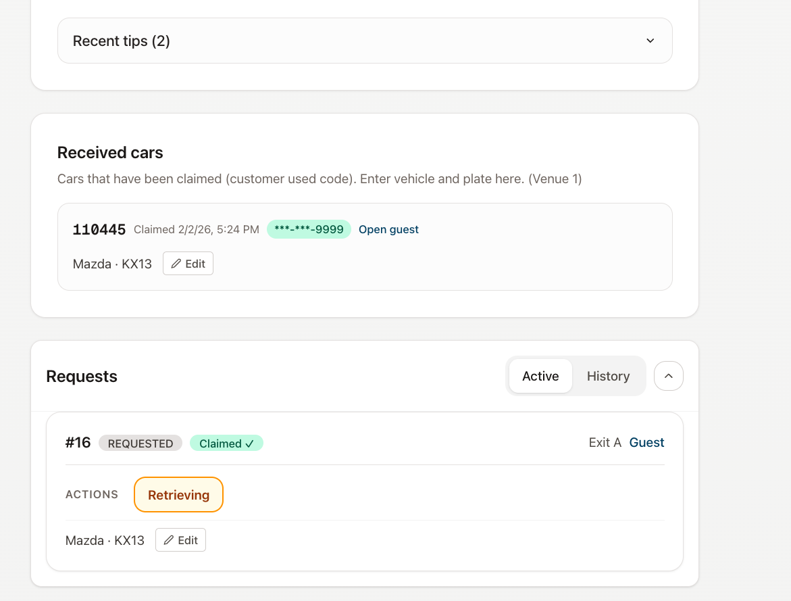
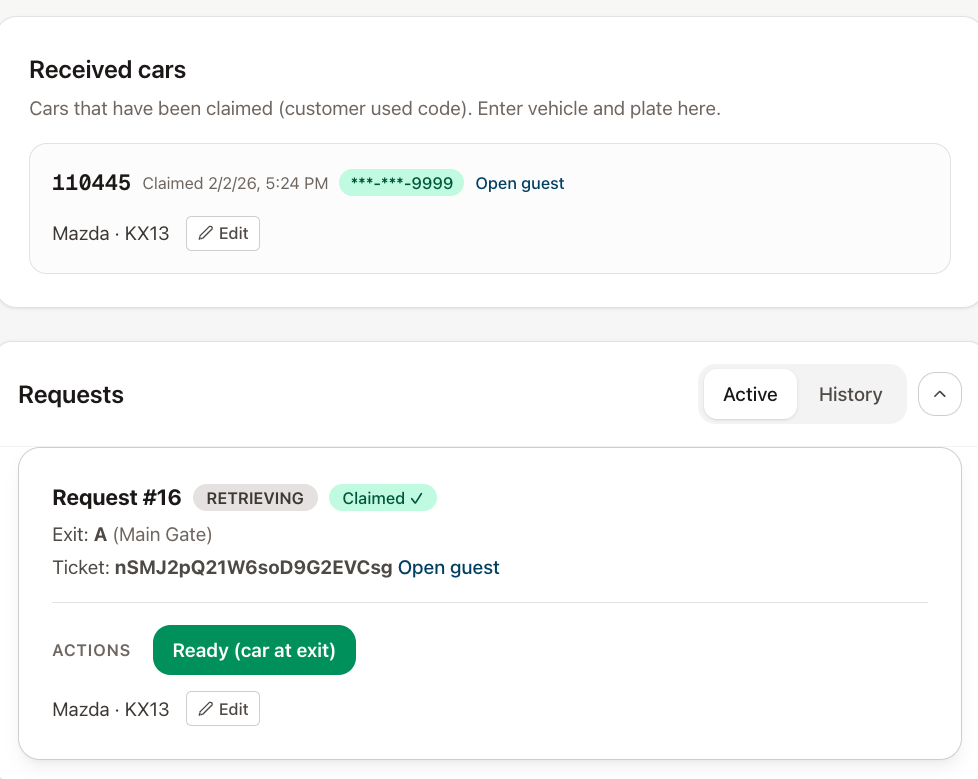
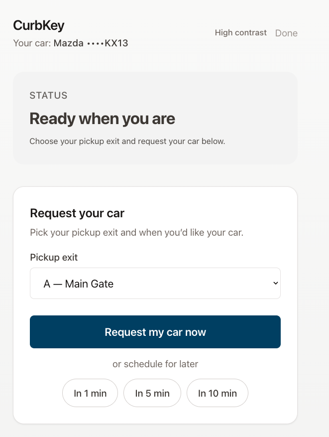
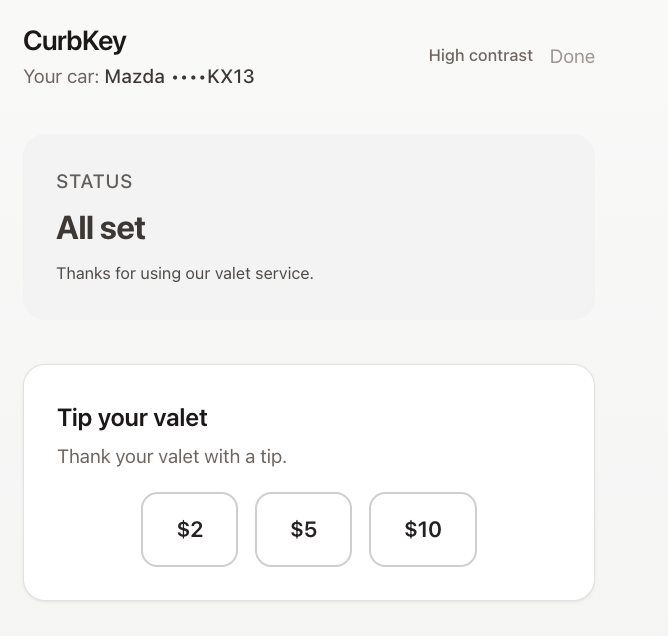

# CurbKey

[](LICENSE)

**Live demo:** - https://curb-key.vercel.app

Valet request and scheduling: guests request their car (now or scheduled), valets update status, managers run the demo and scheduler.

- **Guest:** ticket link → pick exit, request car (now or in 1/5/10 min), see status live.
- **Valet:** Active/History requests, mark Retrieving → Ready → Picked up.
- **Manager:** Seed demo, create tickets, scheduler tick, notifications, tips.

## Why CurbKey

Most valet systems are hardware-heavy, expensive, and designed for permanent garages. CurbKey is built for temporary, high-churn environments — restaurants, events, hospitals, and pop-up valet operations — where speed, zero hardware, and SMS-based identity matter.

The goal is a ticketless, QR-first valet flow that works anywhere in minutes.

## Non-goals (for this demo)

- Not a full enterprise valet system
- No hardware integrations
- No production-grade payments or compliance
- Demo-scale auth and role management

These are intentionally out of scope for the public demo.

## Roadmap (High-level)

- SMS-first guest flow (no app install)
- Tip attribution directly to valet staff
- Multi-exit and large-venue support
- Venue analytics (wait time, throughput)
- Stripe Connect payouts (future)

Roadmap will evolve based on operator feedback.

## Security & Data

- JWT-based auth for staff roles
- CORS restricted by environment
- Secrets managed via environment variables
- No real payment data in this demo

---

## Run the demo locally (2 commands)

**Prerequisites:** Docker (for Postgres), Python 3, Node.js.

**1. Start everything (DB + backend + frontend):**

```bash
cd /path/to/CurbKey
make dev
```

This starts Postgres, runs migrations, starts the backend at **http://127.0.0.1:5001** and the frontend at **http://127.0.0.1:3000**. The script creates `frontend/.env.local` with `NEXT_PUBLIC_API_BASE=http://127.0.0.1:5001` if needed and installs frontend deps on first run. Use Ctrl+C to stop (stops frontend; backend may keep running).

**2. Get a guest link (in a second terminal):**

```bash
cd /path/to/CurbKey
make demo
```

Prints a URL like `http://127.0.0.1:3000/t/xxxxx`. Open it in a browser to use the guest flow.

**Optional:** Open **http://127.0.0.1:3000**, log in as **admin@curbkey.com** / **admin123**, go to Manager → Seed Demo → Create Ticket → Copy Guest Link. Same result without `make demo`.

---

## Quick demo flow

1. **Manager** → Seed Demo → Create Ticket → Copy Guest Link (or use URL from `make demo`).
2. **Guest** → Open link → pick exit → Request my car now (or In 1 min).
3. **Manager** → Scheduler tick (if you scheduled for later).
4. **Valet** → Valet console → Active → Get car → Retrieving → Ready (car at exit).
5. **Guest** → Got my car → tip (optional).

## Demo

| Manager console | Valet console |
|-----------------|---------------|
|  |  |

| Guest — initial (request car) | Guest — after pickup (tip page) |
|-------------------------------|----------------------------------|
|  |  |

---

## Deploy (public demo)

- **Frontend:** Vercel  
- **Backend:** Render / Fly / Railway  
- **DB:** Neon / Supabase / Render Postgres  

Set `NEXT_PUBLIC_API_BASE` on Vercel; set `DATABASE_URL`, `JWT_SECRET_KEY`, `CORS_ORIGINS` on the backend. Health check: `GET /healthz`.

**Step-by-step (Vercel + Render + Supabase):** [docs/DEPLOYMENT.md](docs/DEPLOYMENT.md).

---

## Other commands

| Command | Description |
|--------|-------------|
| `make dev` | Start DB + backend + frontend (local demo) |
| `make demo` | Seed + create ticket, print guest URL (backend must be running) |
| `make db` | Start Postgres only (`infra/docker-compose up -d`) |
| `make db-down` | Stop Postgres |
| `make test` | Run backend tests (in-memory SQLite) |
| `make worker` | Run scheduler + notification worker (optional, for production) |

---

## Repo layout

```
CurbKey/
├── Makefile           # make dev, make demo, make test
├── backend/          # Flask API, migrations (.env.example for env vars)
├── frontend/         # Next.js (.env.example for local API URL)
├── scripts/          # dev.sh, demo.py, tick-scheduler.sh
├── docs/             # DEPLOYMENT.md
├── infra/            # docker-compose (Postgres)
├── LICENSE           # MIT
└── README.md
```

**Stack:** Backend — Python, Flask, SQLAlchemy, Postgres. Frontend — Next.js, React, Tailwind.

**License:** [MIT](LICENSE)
